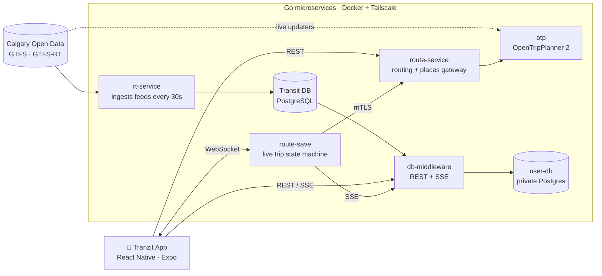

# 🚍 Tranzit

### Calgary Transit, live. Missed your bus? We already rerouted you.

A full-stack transit app for Calgary that turns the city's open real-time feeds into turn-by-turn
transit directions that notice when you miss a bus or a transfer is at risk, and reroute you.

---

## ✨ What it does

| | |
|---|---|
| 🗺️ **Live map** | Every Calgary Transit bus and CTrain on a smooth, GPU-rendered map, updated as they move |
| 🧭 **Real trip planning** | Walk, bike and transit routes from our self-hosted routing engine, adjusted for live delays and cancellations |
| 📍 **Guided commute** | Tracks you stop by stop, counts down to boarding, and uses iOS Live Activities and Android sticky notifications |
| 🔁 **Automatic rerouting** | Spots a missed bus or a transfer at risk and sends you a new route before you're stranded |
| 🗓️ **Day planner** | Lay out your day on a 24-hour timeline and get "leave by" alerts |
| ⭐ **Saved places & alerts** | One-tap favourites, service alerts, and delay history for each stop and route |

## 🏗️ How it works

## 🧩 The stack

| Repo | Role | Built with |
|---|---|---|
| **tranzit-app** | The mobile app: map, routes, commute, planner, saved places | React Native, Expo, TypeScript, MapLibre, SQLite |
| **tranzit-rt-service** | Pulls Calgary's static data and GTFS-RT feeds into Postgres and works out delays | Go, PostgreSQL, WebSocket |
| **tranzit-db-middleware** | Safe, read-only REST API plus live SSE streams over the transit DB | Go, SSE, mTLS |
| **tranzit-otp** | Self-hosted routing engine for walk, bike and transit, with live delays; graph rebuilt weekly | OpenTripPlanner 2, Java, OSM |
| **tranzit-route-service** | API gateway for trip planning (OTP) and place search and autocomplete (Google Places) | Go, Fiber |
| **tranzit-route-save** | Live trip tracking: per-stop state machine, missed-bus detection, rerouting | Go, WebSocket |
| **tranzit-user-db** | User data, reachable only over the private network | PostgreSQL, Tailscale |

> Service repos are private. Reach out if you'd like a walkthrough.

## 🔐 Under the hood

- **Zero-trust networking:** each service runs with its own Tailscale sidecar. Only the HTTP APIs are public (through Tailscale Funnel), and the databases never touch the internet.
- **Two-layer auth:** Supabase JWTs for users; mutual TLS with a private CA between services.
- **Real-time throughout:** GTFS-RT → Postgres → SSE / WebSocket → the device, with delays locked against the first prediction so the delay numbers stay accurate.
- **Self-hosted CI/CD:** a push deploys through GitHub Actions runners on our own hardware.

---

**Built in Calgary, for Calgary.** 🏔️

Data: [City of Calgary Open Data](https://data.calgary.ca) · Routing: [OpenTripPlanner](https://www.opentripplanner.org) · Maps: [MapLibre](https://maplibre.org) + [OpenStreetMap](https://www.openstreetmap.org)

